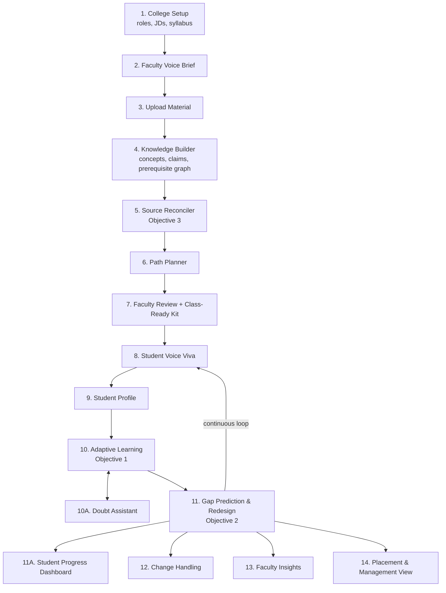
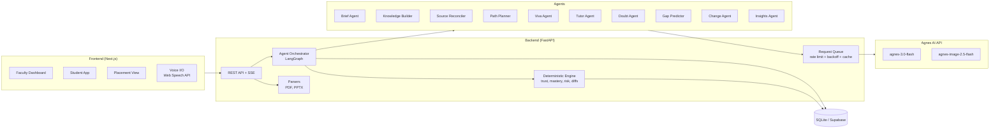

# VidyaPath 🎓

### Agentic, voice-first learning platform that turns faculty material into personalized, industry-ready learning for every student

> Built for **HR26 AI Track – Agnes AI India Hackathon** · Problem Statement **HR26-AI-01: Learning Experiences**

---

## 📌 Problem Statement (HR26-AI-01)

Educators rarely plan teaching at a desk. Ideas come up in staff rooms, on commutes and between classes, often spoken aloud and half-finished. Their material is scattered across lecture notes, PDFs, textbooks, slides and links, and they have very little time to turn it into something that works for every learner.

Learners differ in prior knowledge, language, pace and learning style. Requirements change mid-way: a class falls behind, an exam moves, a new student joins.

**The challenge:** help educators go from scattered resources and rough goals to a learning experience they trust, one that faithfully reflects their own material, adapts to every learner, handles change without starting over, and keeps the educator in control within realistic limits of time, connectivity and cost.

### Minimum Objectives
1. **Adapt** learning content based on learner performance, prior knowledge and preferred learning style.
2. **Predict** future learning gaps and proactively redesign the learner's path before those gaps emerge.
3. **Resolve** conflicting or outdated information across multiple sources and autonomously decide what knowledge to trust.

---

## 💡 Our Solution

**VidyaPath** is a B2B platform for colleges. Faculty speak their teaching goals and upload their existing material. A team of AI agents builds a trusted knowledge base, resolves outdated or conflicting sources (including against current industry job requirements), and creates personalized learning paths for each student. The system continuously predicts who will fall behind and fixes their path *before* the gap appears, while telling faculty what to teach differently tomorrow.

> *"Colleges teach from their own material; recruiters test against today's industry. VidyaPath closes that gap, one student at a time, with the educator in control."*

### Who it serves
| User | Value |
|---|---|
| **Faculty** (primary) | Material turned into ready-to-use, personalized learning; class insights; hours saved every week |
| **Students** | Learning in their language, level and style; doubt support; measurable confidence and role readiness |
| **Placement Officer / HOD** | Batch readiness forecasts per job role; syllabus freshness insights |
| **College management** (buyer) | Better outcomes, curriculum evidence, accreditation support |

---

## ✅ How We Meet the Minimum Objectives

| Objective | How VidyaPath solves it | What you see in the demo |
|---|---|---|
| **1. Adaptive content** | Voice Viva diagnoses prior knowledge → student profile → Tutor Agent adapts level, language (incl. code-mixed) and format (text / audio / diagram / practice). Learning style is *learned* from which formats actually improve scores. | Two students, same topic, completely different lessons; content changes after a wrong answer |
| **2. Gap prediction & proactive redesign** | Risk score per upcoming concept computed from the prerequisite graph, time since practice and pace vs deadline. High risk triggers automatic path redesign with a visible reason chain. | *"Weak in Keys → Joins on Thursday → 74% risk → Hindi audio refresher added Tuesday"* |
| **3. Conflict & trust resolution** | Source Reconciler compares faculty notes, textbooks and industry job descriptions; trust is scored on recency, authority, cross-source agreement and specificity, then explained. Faculty can override. | Outdated claim detected and resolved with reasons; **Syllabus Freshness Report** |

---

## ✨ Key Features

### 👩‍🏫 For Faculty
- **Voice Brief** – speak rough goals anytime; get a structured, editable teaching brief
- **Multi-source upload** – notes, PDFs, PPTs, textbooks, links
- **Source Trust Board** – conflicts and outdated content flagged, resolved and explained
- **Approve & lock** – faculty approves the plan; locked items never change without consent
- **Class-Ready Kit** – lecture outline, slides, handouts, quizzes and assignments generated from *their own* material
- **Class Heatmap & Gap Radar** – see where understanding is growing or stuck
- **Batch Misconception Insights** – e.g. *"40% of students confuse WHERE and HAVING"*
- **Next-Lecture Advisor** – what to revisit, skip or explain differently tomorrow
- **Voice-based changes** – *"Exam moved earlier"* → only affected parts re-plan, with diff view and rollback

### 🧑‍🎓 For Students
- **Adaptive Voice Viva** – spoken, interview-style diagnostic that probes vague answers and detects misconceptions
- **Confidence Calibration** – compares self-rated confidence with actual performance
- **Personalized Lessons** – adapted to level, language and learning style
- **Provenance Highlighting** – 🟩 from faculty material · 🟨 AI-added explanation
- **Doubt Assistant** – ask by voice or text in any supported language; answers come only from trusted material
- **Proactive Refreshers** – inserted before a predicted gap appears
- **Progress Dashboard** – mastery map, confidence trend, role readiness and what's next

### 🏢 For Placement Officer / Management
- **Placement Readiness Forecast** – e.g. *"58% of the batch ready for Data Analyst roles by the December drive"*
- **Syllabus Freshness Report** – alignment of the curriculum with current industry requirements
- **Cost Meter** – running cost per student, keeping AI usage transparent and affordable

---

## 🔄 Workflow



---

## 🏗️ Core Architecture



### Agents

| Agent | Responsibility |
|---|---|
| **Brief Agent** | Converts spoken goals into a structured teaching brief |
| **Knowledge Builder** | Extracts concepts, source-cited claims and the prerequisite graph (uses the 512K context to read all material in one pass) |
| **Source Reconciler** | Detects conflicting/outdated claims, decides what to trust, explains why |
| **Path Planner** | Builds the learning sequence and the Class-Ready Kit |
| **Viva Agent** | Conducts adaptive spoken diagnostics; detects misconceptions and confidence |
| **Tutor Agent** | Generates personalized content with provenance |
| **Doubt Agent** | Answers student doubts grounded only in the trusted knowledge base |
| **Gap Predictor** | Acts on code-computed risk scores to redesign learner paths |
| **Change Agent** | Re-plans only unlocked, unfinished items and produces a diff |
| **Insights Agent** | Next-Lecture Advisor, batch misconceptions, readiness forecast |

### Design principles
- **LLM for understanding and generation, code for numbers.** Trust scores, mastery, risk, readiness and diffs are computed deterministically in Python, so results are consistent and explainable.
- **Grounded by default.** Every claim carries a source, page and quote; quotes are verified against the original text, and unverifiable claims are rejected.
- **Educator in control.** Faculty approve plans, lock items, override trust decisions and roll back versions.
- **Change without restart.** Plans are versioned; updates touch only what's affected.

### Prediction model (simplified)
```
risk(student, concept) = w1 · (1 − min prerequisite mastery)
                       + w2 · decay(days since prerequisite practiced)
                       + w3 · pace lag vs schedule
```
Above a threshold, the Gap Predictor inserts a refresher, reorders topics or switches the learning format.

### Trust model (simplified)
```
trust(claim) = recency + source authority + cross-source agreement + specificity
```
Authority order is configurable by faculty (default: faculty notes > official textbook > industry JD > web link).

---

## 🛠️ Tech Stack

| Layer | Technology |
|---|---|
| **Frontend** | Next.js, React, Tailwind CSS |
| **Visualization** | React Flow (prerequisite graph, Gap Radar), Recharts (heatmaps, trends) |
| **Backend** | FastAPI (Python) |
| **Agent orchestration** | LangGraph |
| **LLM** | `agnes-3.0-flash` – reasoning, extraction, source comparison, path planning, multilingual content, tool calling |
| **Image generation** | `agnes-image-2.5-flash` – diagrams and visual aids for visual learners |
| **SDK** | OpenAI-compatible Python SDK pointed at the Agnes API |
| **Graph logic** | networkx |
| **Document parsing** | pdfplumber, python-pptx |
| **Speech-to-text** | Browser Web Speech API (`en-IN`, `hi-IN`, `kn-IN`) |
| **Text-to-speech** | Browser `speechSynthesis` |
| **Database** | SQLite (local) / Supabase (hosted) |
| **Reliability** | tenacity (retry with backoff), request queue, response cache |
| **Live updates** | Server-Sent Events (agent activity feed) |

> **Note:** Agnes 3.0 Flash accepts text and image-URL input only, so speech-to-text and text-to-speech are handled by a separate component in the browser.

---

## 🔌 Agnes API Usage

| Item | Value |
|---|---|
| Base URL | `https://apihub.agnes-ai.com/v1` |
| Text | `POST /v1/chat/completions` |
| Images | `POST /v1/images/generations` |
| Free-plan limits | Text: 10 RPM · Image (1K): 10 RPM |

### Working within rate limits
- **Fewer, bigger calls:** all source material is processed in one large-context call instead of per page
- **Batching:** content for multiple learners generated together where possible
- **Caching:** identical requests are never sent twice (hashed inputs)
- **Queue + exponential backoff** on rate-limit responses
- **Pre-generation** of demo content; any saved output used as a fallback is clearly labeled

### Security
- API keys are kept **only on the server** (environment variables), never exposed to the browser.

---

## 🗃️ Data Model (core tables)

```
colleges, roles (skill maps), job_descriptions
courses, teaching_briefs
sources, chunks (source_id, page, text)
concepts, prerequisites (concept → concept)
claims (concept, statement, source, page, quote, trust_score, status)
conflicts (claims, resolution, reason, faculty_override)
plans (version, items[status: draft/approved/locked/completed])
students, profiles (language, style, pace)
mastery (student, concept, score, last_practiced)
attempts, vivas (transcript, misconceptions, confidence)
doubts (student, concept, question, answer, sources)
risk_events (student, concept, risk, action, reason)
```

---

## 📁 Project Structure

```
vidyapath/
├── backend/
│   ├── main.py                 # FastAPI app & routes
│   ├── agents/                 # one module per agent
│   │   ├── brief.py
│   │   ├── knowledge_builder.py
│   │   ├── reconciler.py
│   │   ├── planner.py
│   │   ├── viva.py
│   │   ├── tutor.py
│   │   ├── doubt.py
│   │   ├── gap_predictor.py
│   │   ├── change.py
│   │   └── insights.py
│   ├── engine/                 # deterministic logic
│   │   ├── trust.py
│   │   ├── mastery.py
│   │   ├── risk.py
│   │   └── diff.py
│   ├── tools/                  # parsers, quote verifier, agnes client, queue
│   ├── models.py               # Pydantic schemas
│   └── db.py
├── frontend/
│   └── app/
│       ├── faculty/
│       ├── student/
│       └── placement/
├── sample_data/                # demo notes, textbook excerpts, job descriptions
├── .env.example
└── README.md
```

---

## 🚀 Getting Started

### Prerequisites
- Python 3.10+
- Node.js 18+
- An Agnes API key from [platform.agnes-ai.com](https://platform.agnes-ai.com)
- Google Chrome (for the Web Speech API)

### Setup
```bash
# Clone
git clone https://github.com/<your-username>/vidyapath.git
cd vidyapath

# Backend
cd backend
python -m venv venv
source venv/bin/activate        # Windows: venv\Scripts\activate
pip install -r requirements.txt
cp ../.env.example .env         # add your AGNES_API_KEY
uvicorn main:app --reload

# Frontend (new terminal)
cd frontend
npm install
npm run dev
```

### Environment variables
```
AGNES_API_KEY=your_key_here
AGNES_BASE_URL=https://apihub.agnes-ai.com/v1
AGNES_TEXT_MODEL=agnes-3.0-flash
AGNES_IMAGE_MODEL=agnes-image-2.5-flash
DATABASE_URL=sqlite:///./vidyapath.db
```

---

## 🎬 Demo Scenario

**Subject:** DBMS (3rd-year CSE) · **Target role:** Data Analyst

1. Faculty gives a **voice brief** → structured brief appears
2. Uploads lecture notes, a textbook chapter and two job descriptions → **outdated content detected and resolved** → Syllabus Freshness Report
3. Student takes a **Voice Viva** → follow-up on a vague answer → misconception + confidence calibration
4. Two students get **different personalized lessons**, with provenance highlighting
5. A student asks a **doubt in Hindi** → grounded answer
6. **Gap Radar** flags an at-risk student → refresher added before the topic, with reason chain
7. Faculty says *"Placement drive moved earlier"* → only affected items re-plan, with diff view
8. Faculty sees **Next-Lecture Advisor**; placement officer sees **Readiness Forecast**

---

## 💼 Business Model (B2B)

- **Customer:** colleges and universities (placement cells, departments)
- **Pricing:** per student per year, with a free one-semester pilot for one department
- **Why colleges pay:** placement outcomes drive admissions, curriculum evidence supports accreditation, and faculty save preparation time
- **Expansion:** CSE/IT placements → all departments → coaching institutes

---

## 🔒 Responsible AI

- Faculty approve every plan; AI recommends, educators decide
- All generated content shows its source; unsupported claims are rejected
- Doubt Assistant declines rather than guesses when trusted material doesn't cover a question
- Minimal student data collected; designed with India's DPDP Act in mind

---

## 🗺️ Roadmap

- Peer learning pairs (strong ↔ weak on the same concept)
- Accreditation evidence export (NAAC / NBA)
- Offline learner packs for low-connectivity students
- Escalation alerts to faculty when a student stays stuck
- More subjects, roles and regional languages
- LMS integrations

---

## 👥 Team

| Name | Role |
|---|---|
| _Member 1_ | Agents & prompts |
| _Member 2_ | Backend & engine |
| _Member 3_ | Frontend & visualization |
| _Member 4_ | Voice, demo & pitch |

---

## 📚 References

- [Agnes AI Platform](https://platform.agnes-ai.com/)
- [Agnes 3.0 Flash docs](https://wiki.agnes-ai.com/en/docs/agnes-30-flash)
- [Agnes Image 2.5 Flash docs](https://wiki.agnes-ai.com/en/docs/agnes-image-25-flash)
- [Pricing](https://wiki.agnes-ai.com/en/docs/pricing) · [Access plans & RPM limits](https://wiki.agnes-ai.com/en/docs/tokenplan)

---

<p align="center">Built with ❤️ at the HR26 Agnes AI India Hackathon</p>
