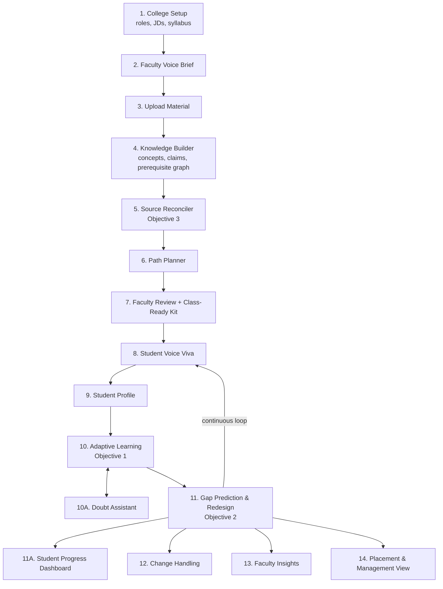
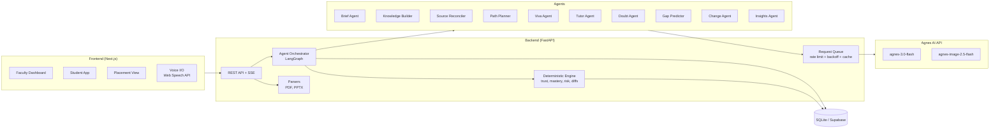

# VidyaPath 🎓

### Agentic, voice-first learning platform that turns faculty material into personalized, industry-ready learning for every student

> Built for **HR26 AI Track – Agnes AI India Hackathon** · Problem Statement **HR26-AI-01: Learning Experiences**

---

## 📌 Problem Statement (HR26-AI-01)

Educators rarely plan teaching at a desk. Ideas come up in staff rooms, on commutes and between classes, often spoken aloud and half-finished. Their material is scattered across lecture notes, PDFs, textbooks, slides and links, and they have very little time to turn it into something that works for every learner.

Learners differ in prior knowledge, pace and learning style. Requirements change mid-way: a class falls behind, an exam moves, a new student joins.

**The challenge:** help educators go from scattered resources and rough goals to a learning experience they trust, one that faithfully reflects their own material, adapts to every learner, handles change without starting over, and keeps the educator in control within realistic limits of time, connectivity and cost.

### Minimum Objectives
1. **Adapt** learning content based on learner performance, prior knowledge and preferred learning style.
2. **Predict** future learning gaps and proactively redesign the learner's path before those gaps emerge.
3. **Resolve** conflicting or outdated information across multiple sources and autonomously decide what knowledge to trust.

---

## 💡 Our Solution

**VidyaPath** is a B2B platform for colleges. Faculty speak their teaching goals and upload their existing material. A team of AI agents builds a trusted knowledge base, resolves outdated or conflicting sources (including against current industry job requirements), and creates personalized learning paths for each student. The system continuously predicts who will fall behind and fixes their path *before* the gap appears, while telling faculty what to teach differently tomorrow.

> *"Colleges teach from their own material; recruiters test against today's industry. VidyaPath closes that gap, one student at a time, with the educator in control."*

### Who it serves
| User | Value |
|---|---|
| **Faculty** (primary) | Material turned into ready-to-use, personalized learning; class insights; hours saved every week |
| **Students** | Learning at their level and in their style; doubt support; measurable confidence and role readiness |
| **Placement Officer / HOD** | Batch readiness forecasts per job role; syllabus freshness insights |
| **College management** (buyer) | Better outcomes, curriculum evidence, accreditation support |

---

## ✅ How We Meet the Minimum Objectives

| Objective | How VidyaPath solves it | What you see in the demo |
|---|---|---|
| **1. Adaptive content** | Voice Viva diagnoses prior knowledge → student profile → Tutor Agent adapts level and format (text / audio / diagram / practice). Learning style is *learned* from which formats actually improve scores. | Two students, same topic, completely different lessons; content changes after a wrong answer |
| **2. Gap prediction & proactive redesign** | Risk score per upcoming concept computed from the prerequisite graph, time since practice and pace vs deadline. High risk triggers automatic path redesign with a visible reason chain. | *"Weak in Keys → Joins on Thursday → 74% risk → audio refresher added Tuesday"* |
| **3. Conflict & trust resolution** | Source Reconciler compares faculty notes, textbooks and industry job descriptions; trust is scored on recency, authority, cross-source agreement and specificity, then explained. Faculty can override. | Outdated claim detected and resolved with reasons; **Syllabus Freshness Report** |

---

## ✨ Key Features

### 👩‍🏫 For Faculty
- **Voice Brief** – speak rough goals anytime; get a structured, editable teaching brief
- **Multi-source upload** – notes, PDFs, PPTs, textbooks, links
- **Source Trust Board** – conflicts and outdated content flagged, resolved and explained
- **Approve & lock** – faculty approves the plan; locked items never change without consent
- **Class-Ready Kit** – lecture outline, slides, handouts, quizzes and assignments generated from *their own* material
- **Class Heatmap & Gap Radar** – see where understanding is growing or stuck
- **Batch Misconception Insights** – e.g. *"40% of students confuse WHERE and HAVING"*
- **Next-Lecture Advisor** – what to revisit, skip or explain differently tomorrow
- **Voice-based changes** – *"Exam moved earlier"* → only affected parts re-plan, with diff view and rollback

### 🧑‍🎓 For Students
- **Adaptive Voice Viva** – spoken, interview-style diagnostic that probes vague answers and detects misconceptions
- **Confidence Calibration** – compares self-rated confidence with actual performance
- **Personalized Lessons** – adapted to level and learning style, with full explanations, diagrams, step-by-step walkthroughs and runnable code
- **Provenance Highlighting** – 🟩 from faculty material · 🟨 AI-added explanation
- **Doubt Assistant** – ask by voice or text; answers come only from trusted material
- **Proactive Refreshers** – inserted before a predicted gap appears
- **Progress Dashboard** – mastery map, confidence trend, role readiness and what's next

### 🏢 For Placement Officer / Management
- **Placement Readiness Forecast** – e.g. *"58% of the batch ready for Data Analyst roles by the December drive"*
- **Syllabus Freshness Report** – alignment of the curriculum with current industry requirements
- **Cost Meter** – running cost per student, keeping AI usage transparent and affordable

---

## 🔄 Workflow



---

## 🏗️ Core Architecture



### Agents

| Agent | Responsibility |
|---|---|
| **Brief Agent** | Converts spoken goals into a structured teaching brief |
| **Knowledge Builder** | Extracts concepts, source-cited claims and the prerequisite graph (uses the 512K context to read all material in one pass) |
| **Source Reconciler** | Detects conflicting/outdated claims, decides what to trust, explains why |
| **Path Planner** | Builds the learning sequence and the Class-Ready Kit |
| **Viva Agent** | Conducts adaptive spoken diagnostics; detects misconceptions and confidence |
| **Tutor Agent** | Generates personalized content with provenance |
| **Doubt Agent** | Answers student doubts grounded only in the trusted knowledge base |
| **Gap Predictor** | Acts on code-computed risk scores to redesign learner paths |
| **Change Agent** | Re-plans only unlocked, unfinished items and produces a diff |
| **Insights Agent** | Next-Lecture Advisor, batch misconceptions, readiness forecast |

### Design principles
- **LLM for understanding and generation, code for numbers.** Trust scores, mastery, risk, readiness and diffs are computed deterministically in Python, so results are consistent and explainable.
- **Grounded by default.** Every claim carries a source, page and quote; quotes are verified against the original text, and unverifiable claims are rejected.
- **Educator in control.** Faculty approve plans, lock items, override trust decisions and roll back versions.
- **Change without restart.** Plans are versioned; updates touch only what's affected.

### Prediction model (simplified)
```
risk(student, concept) = w1 · (1 − min prerequisite mastery)
                       + w2 · decay(days since prerequisite practiced)
                       + w3 · pace lag vs schedule
```
Above a threshold, the Gap Predictor inserts a refresher, reorders topics or switches the learning format.

### Trust model (simplified)
```
trust(claim) = recency + source authority + cross-source agreement + specificity
```
Authority order is configurable by faculty (default: faculty notes > official textbook > industry JD > web link).

---

## 🛠️ Tech Stack

| Layer | Technology |
|---|---|
| **Frontend** | HTML + vanilla JavaScript + Tailwind CSS (CDN), neo-brutalist design adapted from the Campus Zero prototype; served by FastAPI |
| **Visualization** | Mermaid (lesson diagrams); risk, trust and mastery bars in the UI |
| **Backend** | FastAPI (Python) |
| **Agent orchestration** | FastAPI routes + shared knowledge base / SQLite state (LangGraph planned) |
| **LLM** | `agnes-3.0-flash` – viva, practice grading, gap messages (interactive); `claude-opus-5-5` (optional) – heavy extraction from courses and PDFs, source reconciliation, detailed lessons |
| **Image generation** | `agnes-image-2.5-flash` – planned; diagrams currently use Mermaid |
| **SDK** | OpenAI-compatible Python SDK pointed at the Agnes API |
| **Graph logic** | networkx |
| **Document parsing** | pdfplumber, python-pptx |
| **Speech-to-text** | Browser Web Speech API (`en-IN`) |
| **Text-to-speech** | Browser `speechSynthesis` |
| **Database** | SQLite, one database per course (Supabase planned) |
| **Reliability** | rate limiting, retry with backoff, response cache (`backend/tools/agnes_client.py`) |
| **Live updates** | Server-Sent Events (planned) |

> **Note:** Agnes 3.0 Flash accepts text and image-URL input only, so speech-to-text and text-to-speech are handled by a separate component in the browser.

---

## 🔌 Agnes API Usage

| Item | Value |
|---|---|
| Base URL | `https://apihub.agnes-ai.com/v1` |
| Text | `POST /v1/chat/completions` |
| Images | `POST /v1/images/generations` |
| Free-plan limits | Text: 10 RPM · Image (1K): 10 RPM |

### Working within rate limits
- **Fewer, bigger calls:** all source material is processed in one large-context call instead of per page
- **Batching:** content for multiple learners generated together where possible
- **Caching:** identical requests are never sent twice (hashed inputs)
- **Queue + exponential backoff** on rate-limit responses
- **Pre-generation** of demo content; any saved output used as a fallback is clearly labeled

### Security
- API keys are kept **only on the server** (environment variables), never exposed to the browser.

---

## 🗃️ Data Model (core tables)

```
colleges, roles (skill maps), job_descriptions
courses, teaching_briefs
sources, chunks (source_id, page, text)
concepts, prerequisites (concept → concept)
claims (concept, statement, source, page, quote, trust_score, status)
conflicts (claims, resolution, reason, faculty_override)
plans (version, items[status: draft/approved/locked/completed])
students, profiles (style, pace, target role)
mastery (student, concept, score, last_practiced)
attempts, vivas (transcript, misconceptions, confidence)
doubts (student, concept, question, answer, sources)
risk_events (student, concept, risk, action, reason)
```

---

## 🚦 Implementation Status

What runs today versus what the architecture above still plans.

| Area | Status |
|---|---|
| Knowledge Builder (claims with verified quotes, prerequisite graph) | ✅ Built |
| Source Reconciler + trust engine + Syllabus Freshness Report (Objective 3) | ✅ Built |
| Viva Agent (adaptive, follow-ups, misconceptions, confidence calibration) | ✅ Built |
| Tutor Agent (level / format in code, provenance, learned style, diagrams, walkthroughs and code) (Objective 1) | ✅ Built |
| Gap Predictor (risk score, refreshers, format switch, challenge track, class radar) (Objective 2) | ✅ Built |
| Web UI (student + faculty, voice input and read-aloud) served by FastAPI | ✅ Built |
| JWT login: faculty admin, faculty-created student accounts, per-student access control, profile page | ✅ Built |
| PDF / PPTX source upload with page ranges, text preview and build tracking | ✅ Built |
| Claude (`claude-opus-5-5`) for heavy extraction and reconciliation, with automatic fallback to Agnes | ✅ Built (needs Anthropic credits) |
| Multiple courses (DBMS, DSA, Operating Systems and OOP with Java demo courses, switcher in the UI and `scripts/switch_course.py`) | ✅ Built |
| Agents coordinated through FastAPI routes and shared data (`data/*.json` + SQLite) | ✅ Built |
| LangGraph orchestration, SSE streaming | 🔜 Planned |
| Doubt Assistant (answers only from trusted facts, with citations; declines when not covered) | ✅ Built |
| Class-Ready Kit for faculty: lecture outline, sourced handout, multi-level quiz with answer key, industry-based assignment, tuned to class misconceptions, printable | ✅ Built |
| Brief, Change and Insights agents; placement view | 🔜 Planned |
| `agnes-image-2.5-flash` visuals (diagrams currently use Mermaid), Supabase hosting | 🔜 Planned |

---

## 📁 Project Structure

```
Hackerring_project/
├── backend/
│   ├── main.py                 # FastAPI app: API routes + serves the web UI at /ui
│   ├── courses.py              # course registry (DBMS, DSA) and the active course
│   ├── db.py                   # SQLite student state (one database per course)
│   ├── models.py               # Pydantic schemas the agents must return
│   ├── agents/                 # LLM agents (Agnes 3.0 Flash)
│   │   ├── knowledge_builder.py
│   │   ├── reconciler.py
│   │   ├── viva.py
│   │   ├── tutor.py
│   │   ├── gap_predictor.py
│   │   ├── doubt.py
│   │   └── kit.py
│   ├── engine/                 # deterministic decisions (no LLM)
│   │   ├── trust.py            # which source to trust
│   │   ├── mastery.py          # mastery + confidence calibration
│   │   ├── adapt.py            # lesson level / format / learned style
│   │   └── risk.py             # learning-gap risk
│   └── tools/                  # parsers, quote verifier, Agnes client (rate limit, retry, cache)
├── ui/                         # web UI (HTML + Tailwind CDN + vanilla JS)
├── sample_data/                # DBMS demo course: sources, students, answer key
├── sample_data_dsa/            # DSA demo course: sources, students, answer key
├── sample_data_os/             # Operating Systems demo course: sources, students, answer key
├── sample_data_oop/            # OOP with Java demo course: sources, students, answer key
├── data/                       # generated knowledge bases (+ local SQLite databases)
├── scripts/                    # runners and checks for each agent, course switching
├── .env.example
└── README.md
```

---

## 🚀 Getting Started

### Prerequisites
- Python 3.10+
- An Agnes API key from [platform.agnes-ai.com](https://platform.agnes-ai.com)
- Google Chrome or Edge (for voice input via the Web Speech API); an internet connection for the UI's CDN assets

### Setup
```bash
# Clone
git clone https://github.com/vlallen544/Hackerring_project.git
cd Hackerring_project

# Backend (from the repository root)
python -m venv .venv
source .venv/bin/activate        # Windows: .venv\Scripts\activate
pip install -r requirements.txt
cp .env.example .env             # add your AGNES_API_KEY
uvicorn backend.main:app --reload
```

Open <http://localhost:8000> for the web UI (student and faculty views). Interactive API docs are at <http://localhost:8000/docs> and the health check at <http://localhost:8000/health>.

### Logins (JWT)
- **Faculty master login:** `admin` / `admin123`, created on first start. Change the password on the **Profile** page before real use.
- **Students** are created by faculty on **Faculty → 5. Students** (student ID, name, password, learning style, pace, target role). A student logs in with their student ID and only sees their own viva, lessons, path and profile; faculty routes return 403.
- The API issues an HS256 JWT valid for 12 hours (`POST /api/auth/login`), sent as `Authorization: Bearer <token>`. Passwords are stored as salted PBKDF2 hashes in `data/auth.db`; the signing key is `JWT_SECRET` in `.env`, or a random key generated in `data/.jwt_secret`. After 5 wrong passwords, a username is locked for 5 minutes for that address.
- Every user has a **Profile** page (photo, department, email, bio, change password), adapted from the Campus Zero prototype.

### Courses and demo data
Four demo courses are included, each with planted conflicts and an answer key (`expected_results.md`):

| Course | Sources | Switch to it |
|---|---|---|
| DBMS (default) | `sample_data/` | `python scripts/switch_course.py dbms` |
| Data Structures and Algorithms | `sample_data_dsa/` | `python scripts/switch_course.py dsa` |
| Operating Systems | `sample_data_os/` | `python scripts/switch_course.py os` |
| Object-Oriented Programming with Java | `sample_data_oop/` | `python scripts/switch_course.py oop` |

Each course keeps its own knowledge base, faculty overrides and student progress. A course is built automatically the first time you switch to it (about a minute); you can also press **Build course** on the faculty page. Use **Reset student progress** on the faculty page before a demo.

Useful scripts: `run_knowledge_builder.py` and `run_reconciler.py` (check the planted conflicts), `viva_cli.py ravi` (terminal viva), `run_tutor_demo.py keys ravi asha` (same topic, two students), `run_gap_demo.py ravi` (gap prediction).

To verify the Agnes connection and cached JSON client, run `python scripts/hello_agnes.py` and `python scripts/test_client.py` from the repository root after configuring `.env`.

### Environment variables
```
AGNES_API_KEY=your_key_here
AGNES_BASE_URL=https://apihub.agnes-ai.com/v1
AGNES_TEXT_MODEL=agnes-3.0-flash

# Optional: Claude for heavy tasks (reading whole courses / PDFs, reconciling sources)
ANTHROPIC_API_KEY=your_anthropic_key   # leave empty to run everything on Agnes
HEAVY_LLM_PROVIDER=claude
CLAUDE_MODEL=claude-opus-5-5
CLAUDE_EFFORT=high
```

**Which model does what:** the Knowledge Builder (extracting claims from all sources, including PDFs), the prerequisite mapping and the Source Reconciler run on Claude when `ANTHROPIC_API_KEY` is set (`backend/tools/llm.py`); the Viva, Tutor and Gap Predictor messages run on Agnes. If a Claude call fails, the heavy task falls back to Agnes automatically.

---

## 🎬 Demo Scenario

**Subject:** DBMS (3rd-year CSE) · **Target role:** Data Analyst

1. Faculty gives a **voice brief** → structured brief appears
2. Uploads lecture notes, a textbook chapter and two job descriptions → **outdated content detected and resolved** → Syllabus Freshness Report
3. Student takes a **Voice Viva** → follow-up on a vague answer → misconception + confidence calibration
4. Two students get **different personalized lessons**, with provenance highlighting
5. A student asks a **doubt** → grounded answer
6. **Gap Radar** flags an at-risk student → refresher added before the topic, with reason chain
7. Faculty says *"Placement drive moved earlier"* → only affected items re-plan, with diff view
8. Faculty sees **Next-Lecture Advisor**; placement officer sees **Readiness Forecast**

---

## 💼 Business Model (B2B)

- **Customer:** colleges and universities (placement cells, departments)
- **Pricing:** per student per year, with a free one-semester pilot for one department
- **Why colleges pay:** placement outcomes drive admissions, curriculum evidence supports accreditation, and faculty save preparation time
- **Expansion:** CSE/IT placements → all departments → coaching institutes

---

## 🔒 Responsible AI

- Faculty approve every plan; AI recommends, educators decide
- All generated content shows its source; unsupported claims are rejected
- Doubt Assistant declines rather than guesses when trusted material doesn't cover a question
- Minimal student data collected; designed with India's DPDP Act in mind

---

## 🗺️ Roadmap

- Peer learning pairs (strong ↔ weak on the same concept)
- Accreditation evidence export (NAAC / NBA)
- Offline learner packs for low-connectivity students
- Escalation alerts to faculty when a student stays stuck
- More subjects and roles
- LMS integrations

---

## 👥 Team

| Name | Role |
|---|---|
| _Member 1_ | Agents & prompts |
| _Member 2_ | Backend & engine |
| _Member 3_ | Frontend & visualization |
| _Member 4_ | Voice, demo & pitch |

---

## 📚 References

- [Agnes AI Platform](https://platform.agnes-ai.com/)
- [Agnes 3.0 Flash docs](https://wiki.agnes-ai.com/en/docs/agnes-30-flash)
- [Agnes Image 2.5 Flash docs](https://wiki.agnes-ai.com/en/docs/agnes-image-25-flash)
- [Pricing](https://wiki.agnes-ai.com/en/docs/pricing) · [Access plans & RPM limits](https://wiki.agnes-ai.com/en/docs/tokenplan)

---

<p align="center">Built with ❤️ at the HR26 Agnes AI India Hackathon</p>
