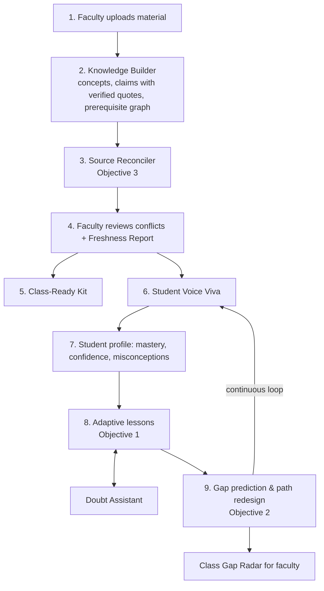
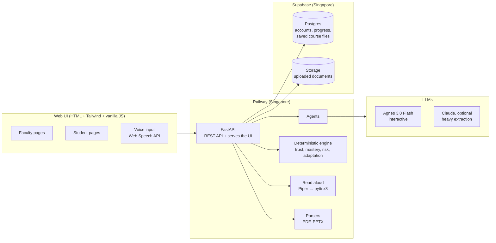

# VidyaPath 🎓

### Agentic, voice-first learning platform that turns faculty material into personalized, industry-ready learning for every student

> Built for **HR26 AI Track – Agnes AI India Hackathon** · Problem Statement **HR26-AI-01: Learning Experiences**

**Live:** <https://hackerringproject-production.up.railway.app> · backend on Railway, data in Supabase

---

## 📌 Problem Statement (HR26-AI-01)

Educators rarely plan teaching at a desk. Ideas come up in staff rooms, on commutes and between classes, often spoken aloud and half-finished. Their material is scattered across lecture notes, PDFs, textbooks, slides and links, and they have very little time to turn it into something that works for every learner.

Learners differ in prior knowledge, pace and learning style. Requirements change mid-way: a class falls behind, an exam moves, a new student joins.

**The challenge:** help educators go from scattered resources and rough goals to a learning experience they trust, one that faithfully reflects their own material, adapts to every learner, handles change without starting over, and keeps the educator in control within realistic limits of time, connectivity and cost.

### Minimum Objectives
1. **Adapt** learning content based on learner performance, prior knowledge and preferred learning style.
2. **Predict** future learning gaps and proactively redesign the learner's path before those gaps emerge.
3. **Resolve** conflicting or outdated information across multiple sources and autonomously decide what knowledge to trust.

---

## 💡 Our Solution

**VidyaPath** is a B2B platform for colleges. Faculty upload their existing material. A team of AI agents builds a trusted knowledge base, resolves outdated or conflicting sources (including against current industry job requirements), and creates personalized learning paths for each student. The system predicts who will fall behind and fixes their path *before* the gap appears, and gives faculty a class-ready kit tuned to what their class keeps getting wrong.

> *"Colleges teach from their own material; recruiters test against today's industry. VidyaPath closes that gap, one student at a time, with the educator in control."*

### Who it serves
| User | Value |
|---|---|
| **Faculty** (primary) | Material turned into ready-to-use, personalized learning; class insights; hours saved every week |
| **Students** | Learning at their level and in their style; doubt support; measurable confidence and role readiness |
| **Placement Officer / HOD** | Readiness forecast per job role before the drive; syllabus freshness against job descriptions |
| **College management** (buyer) | Better outcomes, curriculum evidence, accreditation support |

---

## ✅ How We Meet the Minimum Objectives

| Objective | How VidyaPath solves it | What you see in the app |
|---|---|---|
| **1. Adaptive content** | The Voice Viva diagnoses prior knowledge and confidence → student profile → the Tutor Agent adapts level and format (text / audio / visual / practice). Learning style is *learned* from which formats actually improve practice scores. | Two students, same topic, different lessons; a failed practice question offers a re-teach in another format |
| **2. Gap prediction & proactive redesign** | Code computes a risk score per upcoming concept from prerequisite weakness, forgetting, pace lag and misconceptions. At or above the threshold, the Gap Predictor inserts a refresher before the topic (switching format if one already failed) or moves strong students to a challenge track, with a visible reason. | Gap Radar per student and per class; *"Check for gaps"* adds refreshers with their exact reasons |
| **3. Conflict & trust resolution** | The Source Reconciler compares faculty notes, textbooks, web articles and industry job descriptions; trust is scored on recency, authority, cross-source agreement and specificity, then explained. Faculty can override any decision. | Conflicts board with trust scores and reasons; **Syllabus Freshness Report** |

---

## ✨ Features

✅ built · 🔜 planned

### 👩‍🏫 For Faculty
- ✅ **Multi-source upload** – PDF, PPTX, Markdown and text, with page ranges for big books, text preview and build tracking
- ✅ **Source Trust Board** – conflicts and outdated content flagged, resolved and explained; override with one click
- ✅ **Syllabus Freshness Report** – how well the course matches current job descriptions, with missing and outdated skills
- ✅ **Class-Ready Kit** – lecture outline, sourced handout, multi-level quiz with answer key and an industry-based assignment, generated from *their own* material, tuned to the class's misconceptions, printable
- ✅ **Class Gap Radar** – which students are at risk on which topics
- ✅ **Student accounts** – create students, set or reset passwords, revoke logins, open any student's view
- 🔜 Voice Brief (speak goals → structured brief), approve & lock, Next-Lecture Advisor, voice-based changes with diff and rollback

### 🧑‍🎓 For Students
- ✅ **Adaptive Voice Viva** – spoken, interview-style diagnostic that follows up on vague answers and detects misconceptions
- ✅ **Confidence Calibration** – compares self-rated confidence with actual performance
- ✅ **Personalized Lessons** – adapted to level and learning style, with explanations, diagrams, step-by-step walkthroughs, code, complexity tables and practice
- ✅ **Provenance Highlighting** – 🟩 from faculty material (with source and page) · 🟦 AI-added explanation
- ✅ **Doubt Assistant** – ask by voice or text; answers only from trusted material, with citations; declines when the course doesn't cover it
- ✅ **Proactive Refreshers** – inserted before a predicted gap appears
- ✅ **Read aloud** – every AI output (viva questions, feedback, lessons, doubt answers) can be played with a natural voice
- ✅ **Pick your own course** – each user chooses their subject; it changes only what they see

### 🏢 For Placement Officer / Management
- ✅ **Placement Readiness Forecast** – for every job role in the course: how many students are ready, on track or at risk for the drive date, what holds them back, and which gaps are in the syllabus itself rather than in the students (pure code: job-description skills × measured mastery × each student's planned path)
- ✅ Syllabus Freshness Report (above)
- 🔜 Cost Meter

---

## 🔄 Workflow



---

## 🏗️ Architecture



### Agents

| Agent | Responsibility | Status |
|---|---|---|
| **Knowledge Builder** | Extracts concepts, source-cited claims (quotes verified against the text) and the prerequisite graph | ✅ |
| **Source Reconciler** | Detects conflicting / outdated claims, decides what to trust, explains why; builds the Freshness Report | ✅ |
| **Viva Agent** | Adaptive spoken diagnostic; follow-ups, misconceptions, confidence | ✅ |
| **Tutor Agent** | Personalized lessons with provenance; grades practice answers | ✅ |
| **Gap Predictor** | Builds each student's path; acts on code-computed risk to add refreshers or a challenge track | ✅ |
| **Doubt Agent** | Answers grounded only in the trusted knowledge base | ✅ |
| **Kit Agent** | Class-Ready Kit tuned to the class's mastery and misconceptions | ✅ |
| Brief, Change, Insights agents | Voice brief, re-planning with diffs, next-lecture advice, readiness forecast | 🔜 |

### Design principles
- **LLM for understanding and generation, code for numbers.** Trust scores, mastery, risk and lesson level / format are computed deterministically in Python (`backend/engine/`), so results are consistent and explainable.
- **Grounded by default.** Every claim carries a source, page and quote; quotes are verified against the original text, and unverifiable claims are rejected ("made-up quotes caught").
- **Educator in control.** Faculty override trust decisions and decide which material the agents may use.

### Prediction model
```
risk(student, concept) = 0.65 · prerequisite weakness
                       + 0.15 · forgetting (days since practice, fully faded after 21 days)
                       + 0.10 · pace lag vs schedule
                       + 0.10 · active misconceptions
```
At **0.45** or above, the Gap Predictor inserts a refresher before the topic (switching format if that format already failed); when every prerequisite is at 0.85+, the topic moves to a challenge track. (`backend/engine/risk.py`)

### Trust model
```
trust(claim side) = 0.35 · recency + 0.30 · source authority + 0.25 · cross-source agreement + 0.10 · specificity
```
Absolute claims ("always", "never") are penalized. Source authority defaults are set per course in `sources.json` (default: faculty notes > textbook > job description > web link). (`backend/engine/trust.py`)

---

## 🛠️ Tech Stack

| Layer | Technology |
|---|---|
| **Frontend** | HTML + vanilla JavaScript + Tailwind CSS (CDN), neo-brutalist design adapted from the Campus Zero prototype; served by FastAPI at `/ui`; works on phones (two-row top bar, bottom tab bar, touch-sized buttons) |
| **Visualization** | Mermaid (lesson diagrams), highlight.js (code); risk, trust and mastery bars |
| **Backend** | FastAPI (Python 3.14) |
| **LLM** | `agnes-3.0-flash` – viva, practice grading, doubts, gap messages (interactive); `claude-opus-5-5` (optional) – heavy work: extraction from whole courses and PDFs, source reconciliation, detailed lessons, class kits; automatic fallback to Agnes |
| **SDK** | OpenAI-compatible Python SDK pointed at the Agnes API; Anthropic SDK for Claude |
| **Graph logic** | networkx |
| **Document parsing** | pdfplumber, python-pptx |
| **Speech-to-text** | Browser Web Speech API (`en-IN`) |
| **Text-to-speech** | Server: **Piper** (offline neural voices, default `en_US-lessac-medium`) with **pyttsx3** / espeak-ng as fallback, MP3 via lameenc, cached; the browser plays long texts a few sentences at a time. Browser `speechSynthesis` as the last fallback |
| **Database** | **Supabase Postgres** (one schema per course for student progress, logins in `public`); local SQLite files when `DATABASE_URL` is empty |
| **File persistence** | Uploaded documents, source lists, built course data and faculty overrides are saved to Supabase (Postgres, or Supabase Storage for documents) and restored on every start, because Railway's disk is wiped on each deploy |
| **Auth** | JWT (HS256, 12 h), salted PBKDF2 password hashes, per-student access control |
| **Hosting** | Railway (Railpack build, `railpack.json` + `railway.json`), Supabase, both in Singapore |
| **Reliability** | Rate limiting, retry with exponential backoff and a response cache for Agnes (`backend/tools/agnes_client.py`) |

> **Note:** Agnes 3.0 Flash accepts text and image-URL input only, so speech input runs in the browser and speech output on the server.

---

## 🔌 Agnes API Usage

| Item | Value |
|---|---|
| Base URL | `https://apihub.agnes-ai.com/v1` |
| Text | `POST /v1/chat/completions` |
| Images | `POST /v1/images/generations` (planned; diagrams use Mermaid today) |
| Free-plan limits | Text: 10 RPM · Image (1K): 10 RPM |

### Working within rate limits
- **Fewer, bigger calls:** all source material is processed in one large-context call instead of per page
- **Caching:** identical requests are never sent twice (hashed inputs)
- **Rate limiter + exponential backoff** on rate-limit responses
- **Deterministic engine:** numbers (risk, trust, mastery) never need an LLM call

### Security
- API keys and the database URL live **only on the server** (environment variables), never in the browser.
- Students can only read and change their own data; faculty routes return 403 for students.

---

## 🗃️ Data Model

**Postgres, `public` schema** (shared by all courses)
```
users (username, role, password_hash, student_id)     -- faculty and student logins
student_registry (id, name, stated_style, pace, target_role)
profiles (username, name, department, email, bio, photo)
saved_files (path, content, in_storage)                -- files restored to disk on start
```

**Postgres, one schema per course** (`course_dbms`, `course_dsa`, `course_os`, `course_oop`)
```
students (id, name, stated_style, learned_style, pace, target_role)
mastery (student, concept, score, confidence, last_practiced)
attempts (student, concept, kind, question, answer, correct, misconception)
path_items (student, position, concept, kind, format, status, reason, scheduled_for)
viva_sessions, lessons, lesson_checks, doubts, class_kits, risk_events
```

**Course knowledge** (JSON, per course in `data/courses/<course>/`, saved to Supabase when changed)
```
knowledge_base.json   concepts, claims with verified quotes, prerequisite graph, rejected claims
trusted_kb.json       resolved conflicts, trusted claims, freshness report
faculty_overrides.json
placement.json        the placement drive date
```

---

## 🚦 Implementation Status

| Area | Status |
|---|---|
| Knowledge Builder (claims with verified quotes, prerequisite graph) | ✅ Built |
| Source Reconciler + trust engine + Syllabus Freshness Report (Objective 3) | ✅ Built |
| Viva Agent (adaptive, follow-ups, misconceptions, confidence calibration) | ✅ Built |
| Tutor Agent (level / format in code, provenance, learned style, diagrams, walkthroughs, code) (Objective 1) | ✅ Built |
| Gap Predictor (risk score, refreshers, format switch, challenge track, class radar) (Objective 2) | ✅ Built |
| Doubt Assistant (trusted facts only, citations, declines when not covered) | ✅ Built |
| Class-Ready Kit (outline, handout, multi-level quiz, assignment, printable) | ✅ Built |
| Web UI for students and faculty, voice input, works on phones | ✅ Built |
| Read aloud on every AI output (Piper neural voice, pyttsx3 fallback, chunked playback) | ✅ Built |
| JWT login: faculty admin, faculty-created student accounts, access control, profile page | ✅ Built |
| PDF / PPTX upload with page ranges, text preview and build tracking | ✅ Built |
| Four demo courses; each user picks their own course | ✅ Built |
| Claude for heavy extraction and reconciliation, with automatic fallback to Agnes | ✅ Built (needs Anthropic credits) |
| Supabase Postgres for logins and progress; uploads and course builds survive deploys | ✅ Built |
| Deployed on Railway + Supabase | ✅ Live |
| Supabase Storage for uploaded documents | ✅ Built (active when `SUPABASE_SECRET_KEY` is set; otherwise kept in Postgres) |
| LangGraph orchestration, SSE streaming | 🔜 Planned |
| Placement Readiness Forecast per job role, with drive date and syllabus-gap detection | ✅ Built |
| Brief, Change and Insights agents; cost meter | 🔜 Planned |
| `agnes-image-2.5-flash` visuals (diagrams use Mermaid today) | 🔜 Planned |

---

## 📁 Project Structure

```
Hackerring_project/
├── backend/
│   ├── main.py                 # FastAPI app: API routes + serves the web UI at /ui
│   ├── auth.py                 # logins, JWT, profiles, access control
│   ├── courses.py              # course registry; which course a request is for (X-Course header)
│   ├── db.py                   # student progress tables (one schema / SQLite file per course)
│   ├── sql.py                  # database connection: Supabase Postgres, or SQLite locally
│   ├── storage.py              # saves uploads and course files to Supabase, restores them on start
│   ├── placement.py            # Placement Readiness Forecast (pure code)
│   ├── models.py               # Pydantic schemas the agents must return
│   ├── agents/                 # LLM agents
│   │   ├── knowledge_builder.py
│   │   ├── reconciler.py
│   │   ├── viva.py
│   │   ├── tutor.py
│   │   ├── gap_predictor.py
│   │   ├── doubt.py
│   │   └── kit.py
│   ├── engine/                 # deterministic decisions (no LLM)
│   │   ├── trust.py            # which source to trust
│   │   ├── mastery.py          # mastery + confidence calibration
│   │   ├── adapt.py            # lesson level / format / learned style
│   │   └── risk.py             # learning-gap risk
│   └── tools/                  # Agnes and Claude clients, parsers, quote verification, text-to-speech
├── ui/                         # web UI (HTML + Tailwind CDN + vanilla JS)
├── sample_data/                # DBMS demo course: sources, students, answer key
├── sample_data_dsa/            # DSA demo course
├── sample_data_os/             # Operating Systems demo course
├── sample_data_oop/            # OOP with Java demo course
├── data/courses/<course>/      # built knowledge base, trusted facts, faculty overrides
├── scripts/                    # runners and checks for each agent, default course
├── frontend/                   # early Next.js prototype (not used by the running app)
├── railway.json, railpack.json # Railway build and start configuration
├── .python-version             # Python 3.14
├── requirements.txt
├── .env.example
└── README.md
```

---

## 🚀 Getting Started

### Prerequisites
- Python 3.14 (the version Railway uses; see `.python-version`)
- An Agnes API key from [platform.agnes-ai.com](https://platform.agnes-ai.com)
- Google Chrome or Edge for voice input (Web Speech API); an internet connection for the UI's CDN assets
- Optional: `espeak-ng` for the pyttsx3 read-aloud fallback (Piper needs nothing extra; its voice downloads on first start)

### Run locally
```bash
git clone https://github.com/vlallen544/Hackerring_project.git
cd Hackerring_project

python -m venv .venv
source .venv/bin/activate        # Windows: .venv\Scripts\activate
pip install -r requirements.txt
cp .env.example .env             # add your AGNES_API_KEY
uvicorn backend.main:app --reload
```

Open <http://localhost:8000> for the web UI. API docs are at <http://localhost:8000/docs>; <http://localhost:8000/health> also reports which database is in use.

With `DATABASE_URL` empty, everything is stored locally (SQLite in `data/`), which is the fastest way to develop. Set it to your Supabase URL to work on the shared data instead. A local copy never syncs with the live site unless both use the same `DATABASE_URL`.

### Logins
- **Faculty master login:** `admin`, with the password from `ADMIN_PASSWORD` (default `admin123`), created the first time the database is empty. Change it on the **Profile** page.
- **Students** are created by faculty on **Faculty → 5. Students** (student ID, name, password, learning style, pace, target role). A student logs in with their student ID and only sees their own viva, lessons, path, doubts and profile.
- Login tokens last 12 hours. After 5 wrong passwords, a username is locked for 5 minutes for that address.

### Courses and demo data
Four demo courses are included, each with planted conflicts and an answer key (`expected_results.md`):

| Course | Sources |
|---|---|
| Database Management Systems (default) | `sample_data/` |
| Data Structures and Algorithms | `sample_data_dsa/` |
| Operating Systems | `sample_data_os/` |
| Object-Oriented Programming with Java | `sample_data_oop/` |

Every user picks their course from the dropdown next to the logo (or on the home page); the choice is remembered in their browser and changes only what they see. Each course keeps its own knowledge base, overrides and student progress. Faculty can build a course that was never built (about a minute) or press **Build course** after changing sources. Use **Reset student progress** on the faculty page before a demo.

Useful scripts: `run_knowledge_builder.py` and `run_reconciler.py` (check the planted conflicts), `viva_cli.py ravi` (terminal viva), `run_tutor_demo.py keys ravi asha` (same topic, two students), `run_gap_demo.py ravi` (gap prediction), `switch_course.py dsa` (default course for scripts). `hello_agnes.py` and `test_client.py` check the Agnes connection.

### Environment variables
```
# LLMs
AGNES_API_KEY=your_key_here
AGNES_BASE_URL=https://apihub.agnes-ai.com/v1
AGNES_TEXT_MODEL=agnes-3.0-flash
ANTHROPIC_API_KEY=                    # optional: Claude for heavy tasks; empty = everything on Agnes
HEAVY_LLM_PROVIDER=claude
CLAUDE_MODEL=claude-opus-5-5
CLAUDE_EFFORT=high

# Database (empty = local SQLite). Supabase: Connect -> Session pooler URI; URL-encode the password (@ -> %40)
DATABASE_URL=
DB_POOL_SIZE=5

# Logins
ADMIN_PASSWORD=                       # used only when the admin login is first created
JWT_SECRET=                           # set on a hosted server so logins survive restarts

# Uploaded documents in Supabase Storage (optional; without it they are kept in Postgres)
SUPABASE_URL=https://<project>.supabase.co
SUPABASE_SECRET_KEY=
SUPABASE_BUCKET=sources

# Read aloud (optional)
PIPER_VOICE=en_US-lessac-medium       # any voice from huggingface.co/rhasspy/piper-voices
PIPER_SPEAKER=                        # for multi-speaker voices, e.g. en_US-l2arctic-medium + SVBI
TTS_SPEED=1.05                        # above 1 is slower
TTS_THREADS=0                         # 0 = the CPUs the container may use
```

**Which model does what:** the heavy tasks (Knowledge Builder, prerequisite mapping, Source Reconciler, detailed lessons and Class-Ready Kits) run on Claude when `ANTHROPIC_API_KEY` is set, otherwise on Agnes (`backend/tools/llm.py`). The Viva, practice grading, Doubt Assistant and Gap Predictor messages run on Agnes. If a Claude call fails, the heavy task falls back to Agnes automatically.

---

## ☁️ Deployment (Railway + Supabase)

1. **Supabase:** create a project (Singapore). Copy the **Session pooler** connection string from **Connect** (the direct one is IPv6-only and unreachable from Railway). Tables are created automatically on first start.
2. **Railway:** New Project → Deploy from GitHub → pick the repo and branch; region **Southeast Asia (Singapore)**. Railpack builds it using `railpack.json` (start command, `espeak-ng`) and checks `/health`.
3. **Variables** (Railway → Variables): `DATABASE_URL`, `JWT_SECRET`, `AGNES_API_KEY`, optionally `ANTHROPIC_API_KEY`, `ADMIN_PASSWORD`, `SUPABASE_URL` + `SUPABASE_SECRET_KEY`. Enter only the value in the value box: no `NAME=` prefix, no quotes.
4. **Networking:** Generate Domain (port 8080).
5. **Check:** `https://<your-domain>/health` must say `"database": "postgres"`. On Railway the server refuses to start without Postgres, because its disk is wiped on every deploy.

Every push to the connected branch redeploys automatically. Logins, progress, uploads and built courses live in Supabase and survive deploys and restarts.

---

## 🎬 Demo Scenario

**Subject:** DBMS (3rd-year CSE) · **Target role:** Data Analyst

1. Faculty opens **Sources**: lecture notes, a textbook chapter, a 2016 web tutorial and two job descriptions → **Build course**
2. **Conflicts:** the outdated web claim is detected and resolved with trust scores and reasons; faculty overrides one decision → **Syllabus Freshness Report**
3. A student takes the **Voice Viva** → follow-up on a vague answer → misconception + confidence calibration
4. Two students get **different personalized lessons** on the same topic, with provenance highlighting, read aloud
5. The student asks a **doubt** → grounded answer with citations, or a polite decline when it isn't in the course
6. **Check for gaps** → a refresher is added before a risky topic, with the reason
7. Faculty opens **Class Radar** and generates a **Class-Ready Kit** that targets the class's misconception

---

## 💼 Business Model (B2B)

- **Customer:** colleges and universities (placement cells, departments)
- **Pricing:** per student per year, with a free one-semester pilot for one department
- **Why colleges pay:** placement outcomes drive admissions, curriculum evidence supports accreditation, and faculty save preparation time
- **Expansion:** CSE/IT placements → all departments → coaching institutes

---

## 🔒 Responsible AI

- AI recommends, educators decide: faculty can override every trust decision
- All generated content shows its source; unsupported claims are rejected
- The Doubt Assistant declines rather than guesses when trusted material doesn't cover a question
- Minimal student data collected; designed with India's DPDP Act in mind

---

## 🗺️ Roadmap

- Voice Brief, change handling with diffs and rollback, Next-Lecture Advisor
- Cost meter
- Peer learning pairs (strong ↔ weak on the same concept)
- Accreditation evidence export (NAAC / NBA)
- Offline learner packs for low-connectivity students
- Escalation alerts to faculty when a student stays stuck
- More subjects and roles; LMS integrations

---

## 👥 Team

| Name | Role |
|---|---|
| _Member 1_ | Agents & prompts |
| _Member 2_ | Backend & engine |
| _Member 3_ | Frontend & visualization |
| _Member 4_ | Voice, demo & pitch |

---

## 📚 References

- [Agnes AI Platform](https://platform.agnes-ai.com/)
- [Agnes 3.0 Flash docs](https://wiki.agnes-ai.com/en/docs/agnes-30-flash)
- [Agnes Image 2.5 Flash docs](https://wiki.agnes-ai.com/en/docs/agnes-image-25-flash)
- [Pricing](https://wiki.agnes-ai.com/en/docs/pricing) · [Access plans & RPM limits](https://wiki.agnes-ai.com/en/docs/tokenplan)
- [Piper voices](https://huggingface.co/rhasspy/piper-voices) · [Railway](https://docs.railway.com) · [Supabase](https://supabase.com/docs)

---

<p align="center">Built with ❤️ at the HR26 Agnes AI India Hackathon</p>
